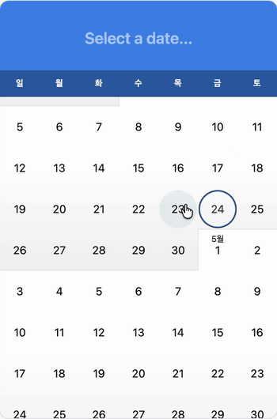

# @reactleaf/calendar

Calendar with single, multiple, and range selection — Temporal dates, optional time editing, and keyboard-friendly interaction.

A modern rewrite of [react-infinite-calendar](https://github.com/clauderic/react-infinite-calendar), built for React 19 with [`@js-temporal/polyfill`](https://github.com/js-temporal/temporal-polyfill) for values.



## Documentation

**[reactleaf.github.io/calendar](https://reactleaf.github.io/calendar/)** — full props reference, live examples, and guides.

## Highlights

- **Modes** — First-class `single`, `multiple`, and `range` on one component (`mode` discriminant).
- **Dates** — Props expect `Temporal.PlainDate` or `Temporal.PlainDateTime` only, not `Date` or raw ISO strings. Parse strings at your app boundary with `Temporal.PlainDate.from(...)` / `Temporal.PlainDateTime.from(...)`.
- **Optional time** — `includeTime` enables header time editing and a dedicated time subview (scroll picker). Date-only flows stay on plain dates; time is minute-precision wall time, not IANA time zones.
- **Bounds & disabling** — `minDate` / `maxDate`, plus per-day disabling in `single` and `multiple` via `isDateDisabled`. `range` uses bounds only (no per-day blacklist).
- **Stable shell** — The card height is stabilized with CSS tokens so switching between day, month, and time views does not resize the shell, even as the infinite-scroll month list grows.
- **Accessibility** — Grid-oriented ARIA for the day body, focus management, keyboard navigation, and localized labels via `locale` + overridable `messages`.

## Requirements

- **React** 19+ and **react-dom** (peers).
- **`@js-temporal/polyfill`** (dependency alongside this package) for `Temporal` in environments that lack it.
- **Styles** — Import the package stylesheet so layout and tokens apply.

## Install

```bash
pnpm add @reactleaf/calendar @js-temporal/polyfill
# or
npm install @reactleaf/calendar @js-temporal/polyfill
# or
yarn add @reactleaf/calendar @js-temporal/polyfill
```

Peers: `react`, `react-dom`.

Import the default styles once (path may vary by bundler):

```tsx
import '@reactleaf/calendar/index.css'
```

Theme hooks such as `--calendar-color-accent`, `--calendar-body-height`, and related tokens live in the bundled CSS; override them in your own stylesheet after the import if you need branding or density tweaks.

## Quick start

```tsx
import { useState } from 'react'
import type { DateValue } from '@reactleaf/calendar'
import { Calendar } from '@reactleaf/calendar'
import '@reactleaf/calendar/index.css'

export function Demo() {
  const [date, setDate] = useState<DateValue | null>(null)
  return <Calendar mode="single" value={date} onSelect={setDate} />
}
```

## Modes

### Single

Pick one date. The value is `Temporal.PlainDate`, or `Temporal.PlainDateTime` when `includeTime` is enabled.

```tsx
import { useState } from 'react'
import type { DateValue } from '@reactleaf/calendar'
import { Calendar } from '@reactleaf/calendar'

export function Example() {
  const [date, setDate] = useState<DateValue | null>(null)
  return <Calendar mode="single" value={date} onSelect={setDate} />
}
```

### Multiple

Select many dates; toggling a chosen day removes it. Use `maxSelections` to cap how many days can be active.

```tsx
import { useState } from 'react'
import type { DateValue } from '@reactleaf/calendar'
import { Calendar } from '@reactleaf/calendar'

export function Example() {
  const [dates, setDates] = useState<DateValue[]>([])
  return <Calendar mode="multiple" value={dates} onSelect={setDates} />
}
```

### Range

Choose a start and end date. 

```tsx
import { useState } from 'react'
import type { CalendarRangeValue } from '@reactleaf/calendar'
import { Calendar } from '@reactleaf/calendar'

const empty: CalendarRangeValue = { start: null, end: null }

export function Example() {
  const [range, setRange] = useState<CalendarRangeValue>(empty)
  return <Calendar mode="range" value={range} onSelect={setRange} />
}
```

`CalendarRangeValue` is `{ start, end }` with each field `DateValue | null`. After a start is chosen, `start` is set and `end` may stay `null` until the range is finished; `onSelect` fires when the range is committed, and `onRangePreview` fires while the user is still choosing.
